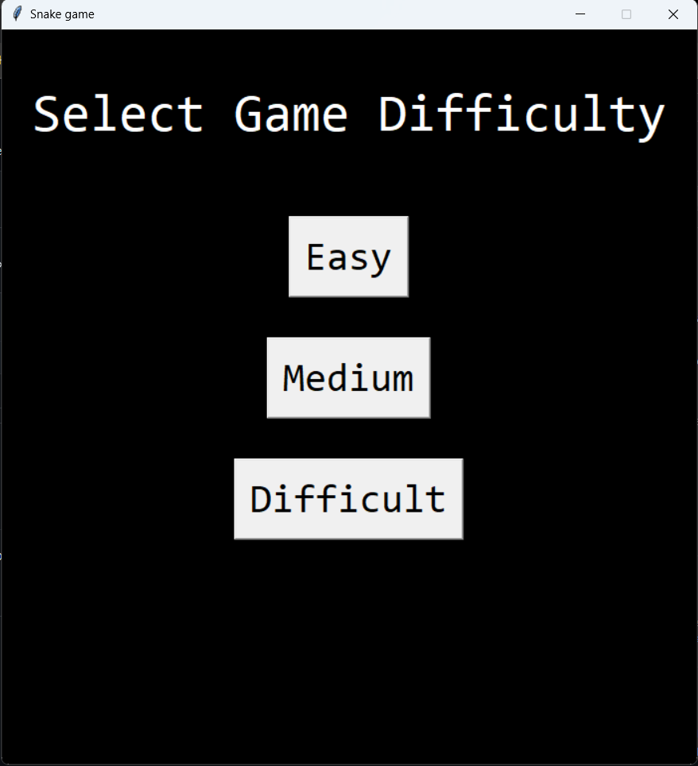

# Snake Game

Experience the classic Snake game with a touch of modern design and customizable difficulty levels.

## Details
This Snake Game is developed using Python's `tkinter` module. Enjoy the throwback to one of the most popular mobile games of its time, now on your computer!

### Dependencies:
You need Python's `tkinter` module. It usually comes pre-installed with Python, but in case it's not: pip install tk

## Features

- **Classic Gameplay**: Relive the classic gameplay of the snake game.
- **Customizable Difficulty**: Choose between Easy, Medium, and Difficult levels as per your expertise.
- **Interactive UI**: A responsive and intuitive user interface using tkinter.
- **Score Tracker**: Keep track of your score in real-time.

## Getting Started

1. **Clone this repository**: git clone https://github.com/Bisalkumar/Snake_Game.git
2. **Navigate to the directory**: cd Snake_game
3. **Run the Snake game**: python game.py

## How to Use

- **Arrow Keys**: Control the movement of the snake.
- **Start Menu**: Set your preferred difficulty before beginning the game.
- **Game Over**: Once the game ends, opt to restart or close the game.

## Screenshots

## Contributions

Contributions, bug fixes, and enhancements are always welcome! Please feel free to open a pull request or raise an issue.

## License

This project is open-source and available under the MIT License. Feel free to use it any way you like.

## Acknowledgements

- Thanks to Python's `tkinter` community for the amazing documentation.
- To all the snake game enthusiasts, thank you for keeping the spirit alive.
