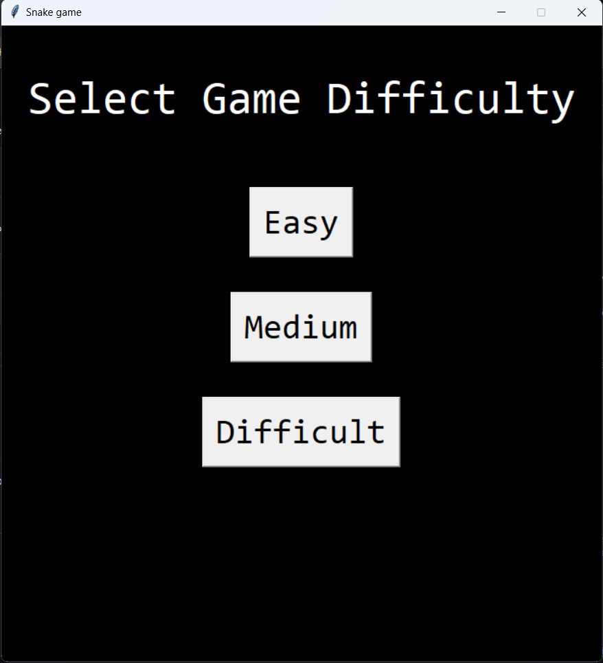

<<<<<<< HEAD
# Snake Game

Experience the classic Snake game with a touch of modern design and customizable difficulty levels.

## Details
This Snake Game is developed using Python's `tkinter` module. Enjoy the throwback to one of the most popular mobile games of its time, now on your computer!

### Dependencies:
You need Python's `tkinter` module. It usually comes pre-installed with Python, but in case it's not: pip install tk

## Features

- **Classic Gameplay**: Relive the classic gameplay of the snake game.
- **Customizable Difficulty**: Choose between Easy, Medium, and Difficult levels as per your expertise.
- **Interactive UI**: A responsive and intuitive user interface using tkinter.
- **Score Tracker**: Keep track of your score in real-time.

## Getting Started

1. **Clone this repository**: git clone https://github.com/Bisalkumar/Snake_Game.git
2. **Navigate to the directory**: cd Snake_game
3. **Run the Snake game**: python game.py
=======
# Slot🐍 - A Simple Emoji-based Slot Machine

A fun and easy-to-play slot machine game built in Python, featuring your favorite emojis.

## Details

**Programming Language**: Python 3

**Modules Needed**:
- `random`
- `time`

## Features

1. Simple console-based UI.
2. Emojis as slot items.
3. Each spin costs $1 with a starting balance of $50.
4. Different payout values for each emoji.
5. Dynamic odds to keep the game interesting.

## Getting Started

### Prerequisites

Ensure you have Python 3 installed on your machine. 

### Installation

1. Clone the repository: git clone https://github.com/Bisalkumar/Slot_Game.git
2. Navigate to the directory and run the game: python game.py
>>>>>>> c3d62092978024dce61f1d8a24770d5ff3f21135

## How to Use

<<<<<<< HEAD
- **Arrow Keys**: Control the movement of the snake.
- **Start Menu**: Set your preferred difficulty before beginning the game.
- **Game Over**: Once the game ends, opt to restart or close the game.
=======
1. Launch the game.
2. Press `<enter>` to spin or type 'c' and press `<enter>` to cash out.
3. The game continues until you choose to cash out or run out of money.
>>>>>>> c3d62092978024dce61f1d8a24770d5ff3f21135

## Screenshots

## Contributions

<<<<<<< HEAD
Contributions, bug fixes, and enhancements are always welcome! Please feel free to open a pull request or raise an issue.

## License

This project is open-source and available under the MIT License. Feel free to use it any way you like.

## Acknowledgements

- Thanks to Python's `tkinter` community for the amazing documentation.
- To all the snake game enthusiasts, thank you for keeping the spirit alive.
=======
We welcome contributions to Slot🐍! Please see the CONTRIBUTING.md for more details.

## License

This project is licensed under the MIT License. See the `LICENSE` file for more details.

## Acknowledgement

Thanks to OpenAI and the community for guidance and suggestions in building this fun project.

>>>>>>> c3d62092978024dce61f1d8a24770d5ff3f21135
